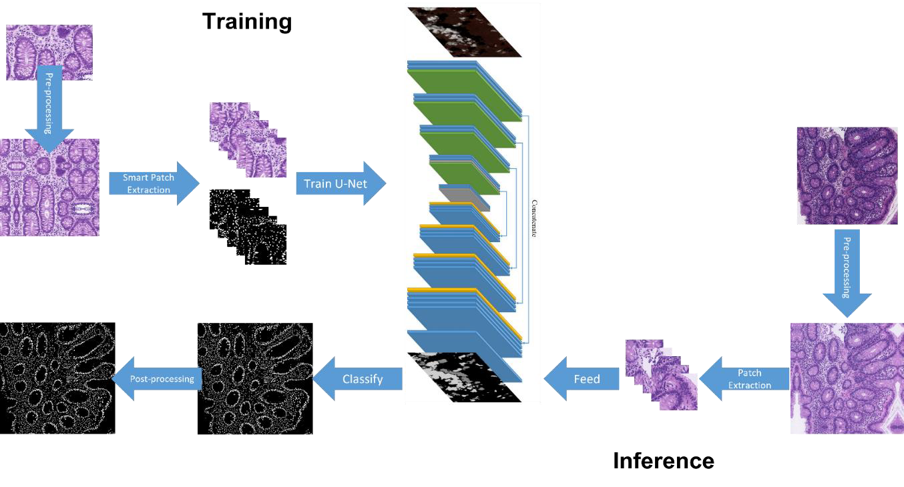
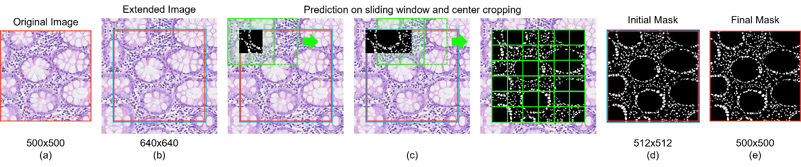

# 🧬 Nuclei Segmentation in H&E Histopathology Images  
**Deep Learning for Digital Pathology – U-Net (PyTorch + MONAI)**

[](https://www.python.org/)
[](https://pytorch.org/)
[](https://monai.io/)
[](https://opencv.org/)
[](LICENSE)

---

### 🧠 Overview
This project focuses on **automatic nuclei segmentation in H&E-stained histopathology images**.  
Using a **2D U-Net** architecture implemented in **PyTorch + MONAI**, the pipeline segments nuclei from tissue micrographs, applies **morphological and watershed post-processing**, and evaluates model performance through robust metrics such as **Dice** and **Aggregated Jaccard Index (AJI)**.

The entire workflow was designed to be **reproducible, modular, and clinically interpretable**.

---

### ⚙️ Pipeline Overview

The segmentation pipeline consists of five main stages:

1. **Dataset Loading & Preprocessing**  
   - Conversion of manual `.mat` annotations (polygon-based masks)  
   - Mirror-padding and tiling into 256×256 patches (50% overlap)  

2. **Training**  
   - Lightweight **U-Net** trained using **Binary Cross Entropy (BCE)** loss  
   - Data augmentation (flips, rotations)  
   - Validation snapshots and best checkpoint saving (`best_metric_model.pth`)  

3. **Inference & Reconstruction**  
   - Patch-by-patch inference and reassembly into full-size segmentation maps  
   - Morphological opening and **marker-controlled watershed** for instance separation  

4. **Evaluation & Testing**  
   - Patch-level: **Dice coefficient**  
   - Whole-image: **Aggregated Jaccard Index (AJI)** and nuclei count error  

---

### 🧩 Visual Workflow

#### 🔹 Full Training and Inference Pipeline


> The complete pipeline from preprocessing and patch extraction to U-Net training, post-processing, and evaluation.

---

#### 🔹 Patch-Based Inference and Reconstruction


> Example of mirror padding, sliding-window inference, and center-cropped reconstruction used during model inference.

---

### 📁 Project Structure

```text
nuclei_seg/
│
├── __init__.py
├── lettura_set.py               # Load images and .mat annotations
├── padding_fun.py               # Mirror padding for patch extraction
├── divisione_in_patch.py        # Patchify images and masks
├── unpatchify_and_unpadding.py  # Reconstruct full-size masks
├── watershed_fun.py             # Marker-controlled watershed segmentation
├── label_instances.py           # Label individual nuclei
├── aji_fun.py                   # Aggregated Jaccard Index computation
├── macenko.py                   # Stain normalization (Macenko method)
│
├── scripts/
│   ├── training_pipeline.py     # Train the U-Net model (PyTorch + MONAI)
│   ├── evaluate_model.py        # Evaluate on training/validation sets
│   └── test_pipeline.py         # Final testing on held-out dataset
│
├── best_metric_model.pth        # Pre-trained U-Net weights
├── patch_inference.png          # Sliding-window inference illustration
├── pipeline_overview.png        # Full pipeline diagram
└── requirements.txt             # Python dependencies


---

### 🚀 Quick Start

#### 1. Clone the repository
```bash
git clone https://github.com/yourusername/nuclei-segmentation.git
cd nuclei-segmentation

2. Install dependencies
pip install -r requirements.txt

3. Train the model (optional)

python training_pipeline.py --dataset-root /path/to/DATASET --output-root ./experiments

4. Use the pre-trained model
A pre-trained U-Net checkpoint (best_metric_model.pth) is included in this repository.
You can skip the training phase and directly run evaluation or testing:
# Evaluate on training and validation sets
python evaluate_model.py --dataset-root /path/to/DATASET --output-root ./experiments

# Evaluate on the held-out test set
python test_pipeline.py --dataset-root /path/to/DATASET --output-root ./experiments
